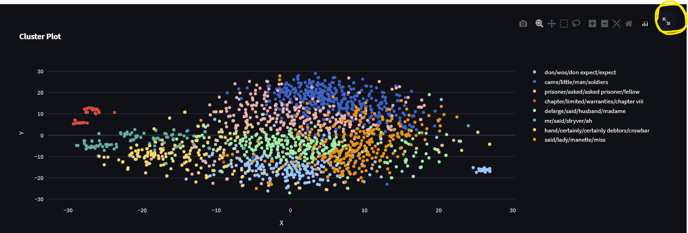

# Clustering Workbench
Clustering Workbench is a powerful Python-based tool for clustering text, built using Streamlit. 

[](https://www.youtube.com/watch?v=xI7giMvVZes)

## How does it work?
The tool utilizes [Google's Universal Sentence Encoder](https://tfhub.dev/google/universal-sentence-encoder-multilingual/3) in conjunction with [OpenTSNE](https://github.com/pavlin-policar/openTSNE), a lightning-fast implementation of t-SNE. It can process plain text files or CSV files with a single column containing text. When provided with a plain text file, it employs sentence embedding similarity to group sentences and create what we can refer to as "pseudo paragraphs." However, if you prefer to avoid this grouping, you can use the CSV mode. Additionally, all data, including text, embeddings, and TSNE output, can be downloaded. Much of the code for this tool is derived from my previous repository, ['Feed Visualizer'](https://github.com/code2k13/feed-visualizer).


## How to run ?
```bash
streamlit run app.py
```
## How to use ?
Context-based help is available for each of the options. I won't bore 
 🥱 you by writing a manual here; instead, explore the tool and let it guide you.

## How to see full screen charts ?
On the chart there is a button you can use to toggle full screen view
.

## What does the 'use zero-shot embedding' option do?

Instead of relying on Google's 'Universal Sentence Transformer', the 'use zero-shot embedding' option utilizes [Huggingface's zero-shot classification](https://huggingface.co/tasks/zero-shot-classification) to generate embeddings based on provided labels. For example, if you assign labels such as "positive, negative, neutral," the resulting embedding for a sentence could resemble "0.3, 0.4, 0.3".

> Note: Exercise caution when experimenting with this option unless you have a GPU. This feature has not yet been tested with a GPU on large datasets.


## References and thanks !

- https://github.com/pavlin-policar/openTSNE 
- https://huggingface.co/tasks/zero-shot-classification
- https://www.tensorflow.org/hub/tutorials/semantic_similarity_with_tf_hub_universal_encoder
